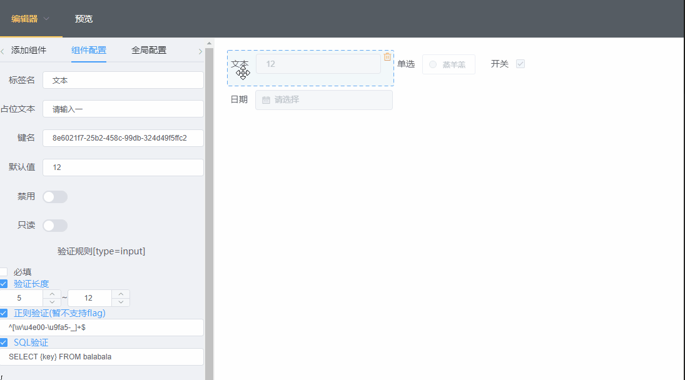

# 超级表单

> `表单` `表格` `图表` 可视化配置以及实时预览。

## 拖拽排序
 
## 实时编辑预览
 

## TODO
- [x] 常用验证规则封装
- [x] 为文本框配置`SQL`验证规则
- [x] (单选多选等)`options`增删改
- [x] `省/市/区`级联快捷配置
- [ ] 为`options`配置`Ajax`接口
- [ ] 为下拉框配置`从服务器搜索`
- [ ] 富文本支持
- [ ] 文件上传支持
- [x] 动态换肤
- [ ] 表格
- [ ] Echarts
<!-- - [ ] 为options集成 `默认值` 功能 -->
<!-- - [ ] 允许添加多条`RegExp`, `SQL`验证规则 -->
